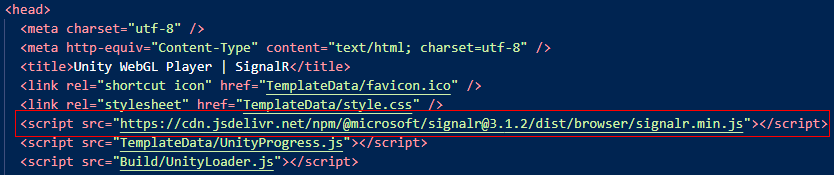
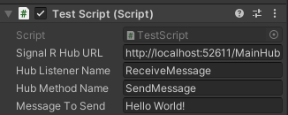
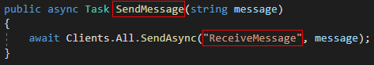
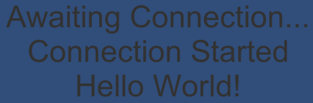

# Unity WebGL SignalR

## Repo Components

- **Unity**: Unity3D project with Core SignalR Plugin (for editor / WebGL) and example scene
- **Server**: ASP.NET Core project with a single SignalR hub for connection (CORS enabled)
- **Client**: Node.js/Express project to serve built WebGL files from Unity

The hub is set to receive and broadcast a global message that invokes the listeners of all connected clients.

This functionality could be greatly extended for actual use in games or applications.

## Plugin

The files needed adding the Plugin to a Unity3D project are located at:

[Unity/Assets/Plugins/SignalR](./Unity/Assets/Plugins/SignalR)

### Client C# Packages

- _Microsoft.AspNetCore.SignalR.Client - 3.1.10_

To import SignalR and all dependencies (targeting .NET Standard 2.0), you must have the NuGet CLI installed locally:

[NuGet CLI reference](https://docs.microsoft.com/en-us/nuget/reference/nuget-exe-cli-reference)

Once NuGet is installed, run the following command in PowerShell from the project base directory:

```console
./signalr.ps1
```

This will import and move the target .dll files to the plugin's packages directory.

Note: These packages are only needed for use in the editor.

### Client JS File

Once the WebGL project is built, the following must be referenced in the 'head' section of index.html:

[https://cdn.jsdelivr.net/npm/@microsoft/signalr@3.1.10/dist/browser/signalr.min.js](https://cdn.jsdelivr.net/npm/@microsoft/signalr@3.1.10/dist/browser/signalr.min.js)



## Usage

Attach a script file to a GameObject in your scene and add the following code to your 'Start' method:

```c#
srLib = new SignalRLib();
srLib.Init("<SignalRHubURL>", "<HubListenerName>");

srLib.ConnectionStarted += (object sender, ConnectionEventArgs e) =>
{
    Debug.Log(e.ConnectionId);
    srLib.SendMessage("<HubMethodName>", "<MessageToSend>");
};

srLib.MessageReceived += (object sender, MessageEventArgs e) =>
{
    Debug.Log(e.message);
};
```

### Properties





- **SignalR Hub URL**: Endpoint for the target SignalR hub
- **Hub Listener Name**: Name of listener to be invoked by the hub
- **Hub Method Name**: Name of method in the Hub to receive message
- **Message to Send**: Message to send to the hub

### Successful Result



## References

- [Unity Manual - WebGL: Interacting with browser scripting](https://docs.unity3d.com/Manual/webgl-interactingwithbrowserscripting.html)
- [Introduction to ASP.NET Core SignalR](https://docs.microsoft.com/en-us/aspnet/core/signalr/introduction?view=aspnetcore-3.1)
- [jirihybek/unity-websocket-webgl](https://github.com/jirihybek/unity-websocket-webgl)
